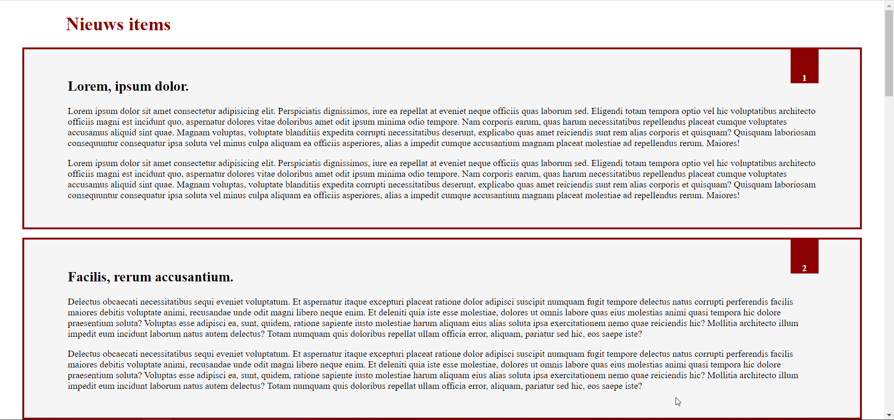
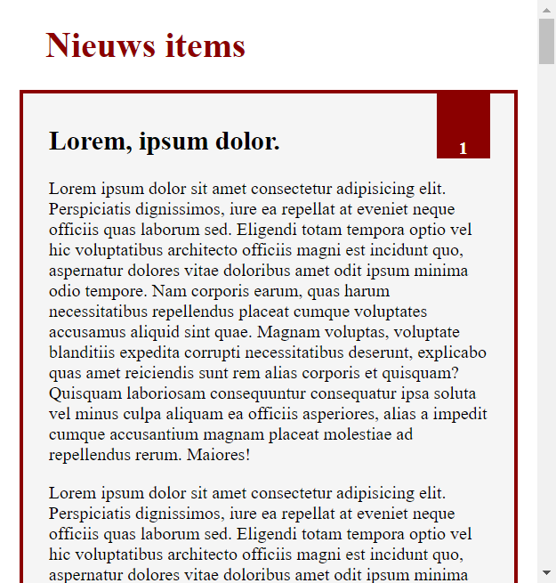

# oe05a-positionering-nieuwswebsite
Positioneren van een vlaggetje op een nieuwswebsite.

# Opdracht
Je krijgt een sjabloon van een nieuwswebsite met 10 artikelen.
Bij elk artikel zie je een vlaggetje met het artikelnummer staan.
Zorg ervoor dat het vlaggetje in de rechterhoek van elke `article` komt te staan m.b.v. positionering in CSS.

# Resultaat
## Full screen

## Klein scherm

